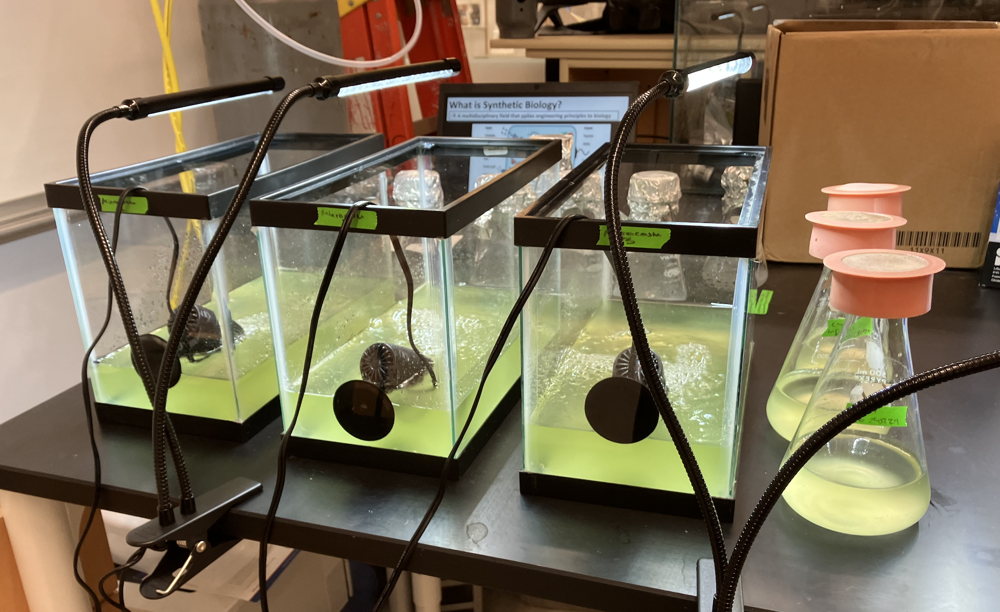
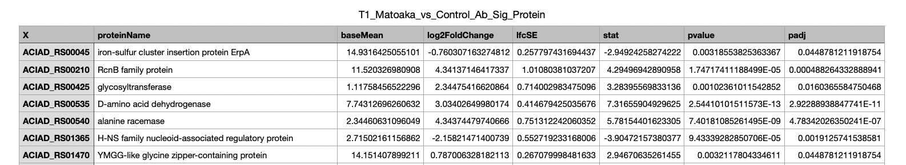

# abaylyi-hab-microcosms
**Madeline Eibner-Gebhardt, 2026**  
*William & Mary iGEM 2025*

Pipeline to obtain differential gene expression (DE) data and taxonomic profiles for metatranscriptomic data from nonsterile lakewater microcosms and control cultures inoculated with chassis bacterium *Acinetobacter baylyi* ADP1-ISx and bloom-causing cyanobacterium *Microcystis aeruginosa* LE3.



## Dependencies

### Software Tools
All relevant software tools and their dependencies are included in the Conda environments **de-env** and **salmon-env**. Below are the key tools and version numbers:
* **ncbi-datasets-cli:** 18.23.0
* **fastp:** 1.3.2
* **kraken2:** 2.17.1
* **sortmerna:** 4.3.7
* **spades:** 4.2.0
* **minimap2:** 2.30
* **samtools:** 1.23.1
* **salmon:** 1.11.4
* **R:** 4.5.3
* **tximport:** 1.38.2
* **deseq2:** 1.50.2

### Reference Sequences and Databases
* ***A. baylyi*** ADP1 GCF_000046845.1
* ***M. aeruginosa*** LE3 GCF_032701645.1
* **Kraken core-nt db:** k2_core_nt_20251015
* **SortMeRNA default db:** smr_v4.3_default_db

## Directory Structure
```bash
.
├── data
│   ├── clean
│   ├── clean_metadata.tsv
│   ├── filtered
│   ├── raw
│   └── raw-reads_summary.tsv
├── de-env.yml
├── output
│   ├── assemblies
│   ├── counts
│   │   ├── formatted
│   │   └── raw
│   ├── de-genes
│   └── taxonomy
├── pipeline.slurm
├── README.md
├── references
│   ├── databases
│   ├── id-conversion
│   └── sequences
├── salmon-env.yml
└── scripts
    ├── 00a_download_raw_data.slurm
    ├── 00b_download_refs.sh
    ├── 00c_download_databases.slurm
    ├── 00__create_envs.sh
    ├── 00__setup.sh
    ├── 01_clean_raw_data.sh
    ├── 02_taxonomic_profile.sh
    ├── 03_deplete_rrna.sh
    ├── 04_assemble_ref.sh
    ├── 05_quantify_counts.sh
    ├── 06_create_tx2gene_ref.sh
    ├── 07_format_input.R
    ├── 08_get_de-genes.R
    └── 09_get_proteins.R
```

## Setup
Before running the pipeline, clone this repository and run the below setup steps in order from the project directory:
1. Ensure basic directory structure
```bash
./scripts/00__setup.sh
```
2. Create conda environments using the provided .yml files
```bash
./scripts/00__create_envs.sh
```
3. Download raw data from SRA and generate reads summary
```bash
sbatch ./scripts/00a_download_raw_data.slurm
```
4. Download *A. baylyi* and *M. aeruginosa* reference sequences
```bash
./scripts/00b_download_refs.sh
``` 
5. Download reference databases for Kraken2 and SortMeRNA 
```bash
sbatch ./scripts/00c_download_databases.slurm
```

## Usage
After completing the setup steps above, run the below command from the project directory:
```bash
sbatch pipeline.slurm
```

## Outputs
**Kraken taxonomic profile** reports containing read counts at all taxonomic levels can be found in the **./output/taxonomy** directory. Reports may be visualized and summarized with the **Pavian** web tool.

**DE gene lists** containing lists of significantly DE genes (padj<0.05) in csv format can be found in the **./output/de-genes** directory. Files with ending _Sig_Protein.csv contain the locus tag *and* the associated protein name from the gff reference file. Files are labeled accourding to the timepoint, comparison of interest, and species. See sample output below:



## References
